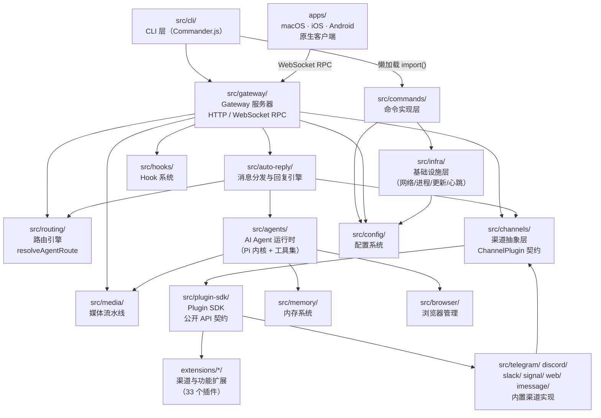
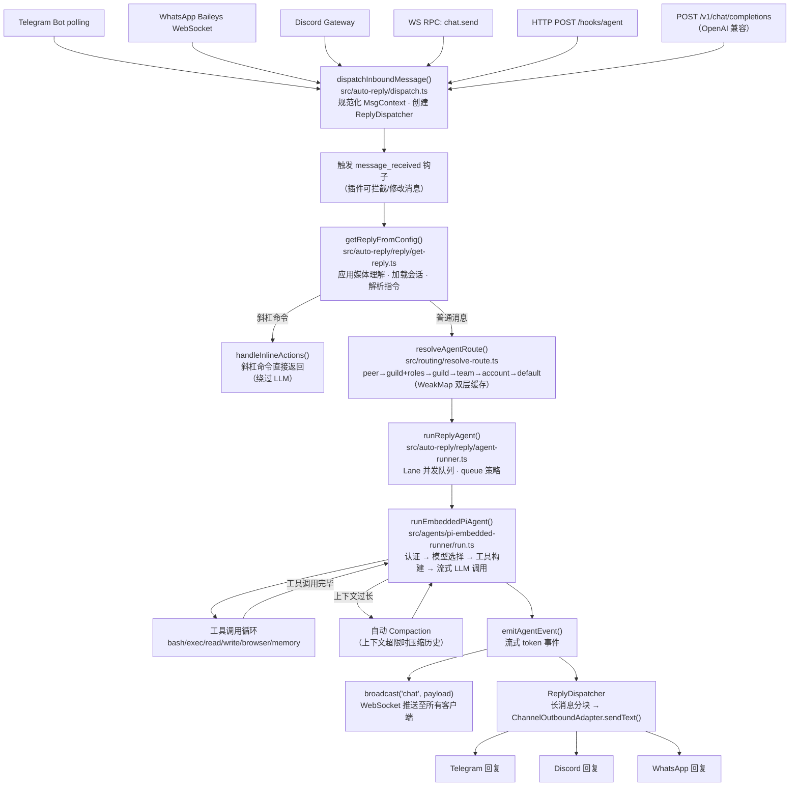

# OpenClaw 项目技术文档

> 版本：2026.3.9 · 生成日期：2026-03-10

---

## 1. 项目架构概览

### 项目类型与技术栈

OpenClaw 是一个**多频道 AI 网关（Multi-Channel AI Gateway）** Monorepo，核心定位是将主流即时通讯平台（Telegram、Discord、WhatsApp、Slack、Signal、Matrix、Teams 等 29+ 个渠道）统一接入，并通过内嵌的 AI Agent 运行时（基于 Pi AI 内核）提供智能自动回复、工具调用与多 Agent 协作能力。

| 维度 | 技术选型 |
| :--- | :--- |
| **主语言** | TypeScript 5.x（严格模式，ESM，NodeNext 模块解析） |
| **运行时** | Node.js ≥ 22.12.0 / Bun（并行支持） |
| **包管理** | pnpm 10.23（workspace Monorepo）+ Bun patching |
| **构建工具** | tsdown（ESM bundle）+ tsc（Plugin SDK dts 类型声明） |
| **类型检查** | `@typescript/native-preview`（`pnpm tsgo`） |
| **测试框架** | Vitest（单元/集成/E2E，V8 覆盖率，70% 阈值） |
| **代码质量** | Oxlint + Oxfmt（格式化/检查一体化） |
| **AI 内核** | `@mariozechner/pi-*`（Pi AI 嵌入式运行时） |
| **HTTP 服务** | Express 5.x |
| **CLI 框架** | Commander.js |
| **Schema 验证** | `@sinclair/typebox` + Zod 4 |
| **原生客户端** | macOS（Swift/SwiftUI）、iOS（Swift）、Android（Kotlin/Jetpack Compose） |
| **文档平台** | Mintlify（`docs.openclaw.ai`），支持 zh-CN/ja-JP 自动翻译 |

### 顶层架构模式

项目采用**分层插件化架构**，整体可划分为五个水平层次：

```
┌──────────────────────────────────────────────────────────┐
│  原生客户端层  macOS App · iOS App · Android App         │
├──────────────────────────────────────────────────────────┤
│  CLI / Web UI 层  Commander.js · Control Dashboard       │
├──────────────────────────────────────────────────────────┤
│  Gateway 层  HTTP/WebSocket RPC · 认证 · 路由 · Hooks    │
├──────────────────────────────────────────────────────────┤
│  核心引擎层  Agent运行时 · 消息路由 · 渠道抽象 · 媒体     │
├──────────────────────────────────────────────────────────┤
│  插件/扩展层  33 个 Channel/功能扩展（extensions/*）       │
└──────────────────────────────────────────────────────────┘
```

渠道层采用**适配器模式（Adapter Pattern）**——所有渠道（内置与扩展）均实现统一的 `ChannelPlugin` 接口契约，核心通过 `ChannelGatewayAdapter`、`ChannelOutboundAdapter` 等 17 个可选适配器与各渠道交互，无需感知底层实现差异。

### 构建与部署

| 环节 | 说明 |
| :--- | :--- |
| **构建** | `pnpm build` → tsdown 打包 ESM 输出至 `dist/`，再生成 Plugin SDK `.d.ts` 类型声明 |
| **类型检查** | `pnpm tsgo`（`@typescript/native-preview`）；构建时同步检查 |
| **开发运行** | `pnpm openclaw <cmd>`（bun 直接执行 TS 源文件）或 `pnpm dev` |
| **CLI 入口** | `openclaw.mjs` → `dist/index.js` |
| **Plugin SDK** | `openclaw/plugin-sdk` 及 `openclaw/plugin-sdk/<channel>` 子路径，通过 jiti 别名在开发时解析 |
| **插件安装** | `openclaw plugins install @openclaw/<name>`，运行 `npm install --omit=dev` 于插件目录 |
| **macOS 应用** | SwiftUI 菜单栏应用，通过 `GatewayProcessManager` 管理本地 Node.js Gateway 进程 |
| **Docker** | `Dockerfile.sandbox`（沙箱环境），CI 提供 `test:docker:*` 多套场景 |
| **自动更新** | macOS 使用 Sparkle（`appcast.xml`）；CLI 使用 `src/infra/update-runner.ts` |
| **版本号** | `package.json`、iOS/Android/macOS `Info.plist`/`build.gradle.kts` 需同步更新 |

---

## 2. 目录结构及其职责

### 根目录

| 目录/文件路径 | 主要职责 | 关键文件/子目录示例 |
| :--- | :--- | :--- |
| `src/` | TypeScript 核心源码 | `index.ts`、`cli/`、`gateway/`、`agents/`、`channels/` |
| `extensions/` | 渠道与功能扩展插件（独立 workspace 包） | `msteams/`、`matrix/`、`zalo/`、`voice-call/` |
| `apps/` | 原生客户端应用 | `macos/`、`ios/`、`android/`、`shared/` |
| `docs/` | Mintlify 文档站（英文主库） | `channels/`、`concepts/`、`cli/`、`zh-CN/`（自动生成）|
| `ui/` | Web 控制面板前端 | SPA 静态资源 |
| `scripts/` | 构建/发布/测试辅助脚本 | `committer`、`package-mac-app.sh`、`docs-i18n` |
| `packages/` | 其他 workspace 包 | `clawdbot/` |
| `skills/` | 可安装技能包 | `obsidian/`、`spotify/`、`things/` |
| `vendor/` | 第三方代码（不走 npm） | `a2ui/`（Canvas bundle）|
| `test-fixtures/` | 测试夹具数据 | 媒体文件、配置样本 |
| `.github/` | GitHub Actions、PR/Issue 模板 | `workflows/`、`ISSUE_TEMPLATE/`、`labeler.yml` |
| `.agents/` | AI 代理工作流配置与技能 | `skills/PR_WORKFLOW.md` |
| `openclaw.mjs` | CLI 可执行入口 | — |
| `appcast.xml` | macOS Sparkle 更新源 | — |
| `CHANGELOG.md` | 用户可见变更日志 | — |
| `AGENTS.md` / `CLAUDE.md` | AI 代理协作规则（symlink 关系）| — |

### `src/` 子目录

| 目录路径 | 主要职责 | 关键文件/子目录示例 |
| :--- | :--- | :--- |
| `src/index.ts` | 程序主入口：环境初始化、CLI 构建、公共 API 导出 | — |
| `src/cli/` | CLI 层：Commander 构建、命令懒加载注册、依赖注入 | `program/`、`deps.ts`、`gateway-cli.ts`、`channels-cli.ts`、`progress.ts` |
| `src/cli/program/` | 命令注册中心、预动作钩子、帮助系统 | `build-program.ts`、`command-registry.ts`、`preaction.ts` |
| `src/commands/` | 所有 CLI 命令的具体实现（~286 文件）| `onboard-interactive.ts`、`doctor.ts`、`backup.ts`、`agent.ts`、`configure.*.ts` |
| `src/channels/` | 渠道抽象层：注册表、插件接口类型系统、会话记录、命令门控 | `registry.ts`、`plugins/`、`session.ts`、`typing.ts`、`command-gating.ts` |
| `src/channels/plugins/` | `ChannelPlugin` 契约的完整类型定义（17 个适配器接口）| `types.plugin.ts`、`types.adapters.ts`、`types.core.ts` |
| `src/routing/` | 消息路由引擎：多级优先级匹配 + 双层 WeakMap 缓存 | `resolve-route.ts`、`session-key.ts`、`bindings.ts`、`account-lookup.ts` |
| `src/config/` | 配置系统：读写、Schema 验证、类型定义、会话存储、版本迁移 | `types.ts`（聚合 35 个子类型）、`io.ts`、`schema.ts`、`sessions.ts` |
| `src/gateway/` | Gateway HTTP/WS 服务器：认证、RPC 分发、Hook 路由、节点注册 | `server.ts`、`server-http.ts`、`server-ws-runtime.ts`、`auth.ts`、`server-methods/` |
| `src/gateway/server-methods/` | 所有 WebSocket RPC 方法实现（100+ 个方法）| `chat.ts`、`agent.ts`、`config.ts`、`sessions.ts`、`nodes.ts`、`cron.ts` |
| `src/agents/` | AI Agent 运行时核心（最大模块，500+ 文件）| `pi-embedded-runner/`、`models-config.ts`、`session-*.ts`、`compaction.ts`、`sandbox.ts`、`subagent-*.ts` |
| `src/auto-reply/` | 入站消息分发与 AI 回复引擎 | `dispatch.ts`、`reply/`、`templating.ts`、`block-reply-pipeline.ts` |
| `src/auto-reply/reply/` | 回复流水线：上下文初始化、队列管理、Agent 调用 | `get-reply.ts`、`agent-runner.ts`、`reply-dispatcher.ts`、`init-session-state.ts` |
| `src/plugin-sdk/` | Plugin SDK 公开 API（111 文件，按渠道分子路径）| `index.ts`（600+ 行重导出）、`msteams.ts`、`matrix.ts`、各渠道子模块 |
| `src/infra/` | 基础设施层（~293 文件）：端口、进程、网络、存储、更新、心跳、诊断 | `ports.ts`、`exec-host.ts`、`fetch.ts`、`update-runner.ts`、`heartbeat-runner.ts`、`json-file.ts` |
| `src/media/` | 媒体处理流水线：存储、HTTP 服务、转码、图片操作、PDF 提取 | `store.ts`、`server.ts`、`ffmpeg-exec.ts`、`image-ops.ts`、`pdf-extract.ts` |
| `src/telegram/` | Telegram 内置渠道实现（grammy）| `channel.ts`、`send.ts`、`polling.ts` |
| `src/discord/` | Discord 内置渠道实现（discord.js）| `channel.ts`、`send.ts`、`gateway.ts` |
| `src/slack/` | Slack 内置渠道实现（@slack/bolt）| `channel.ts`、`app.ts` |
| `src/signal/` | Signal 内置渠道实现（signal-cli）| `channel.ts`、`daemon.ts` |
| `src/imessage/` | iMessage 内置渠道实现 | `channel.ts` |
| `src/web/` | WhatsApp Web 渠道实现（Baileys）| `channel.ts`、`qr.ts` |
| `src/memory/` | 内存/记忆系统 | `memory-files.ts`、`search.ts` |
| `src/hooks/` | Hook 系统：注册、触发、内置 hooks | `registry.ts`、`bundled/session-memory.ts` |
| `src/browser/` | Playwright/CDP 浏览器管理 | `chrome.ts`、`cdp.ts`、`pw-tools.ts`、`server.ts` |
| `src/acp/` | ACP 协议（Agent Control Protocol）实现 | `handler.ts`、`types.ts` |
| `src/canvas-host/` | Canvas（a2ui）宿主：WS 代理、HTTP 服务 | `server.ts`、`a2ui/`（bundle 产物）|
| `src/cron/` | 定时任务引擎 | `cron-runner.ts`、`cron-store.ts` |
| `src/daemon/` | systemd/launchd 守护进程管理 | `daemon.ts`、`launchd.ts` |
| `src/context-engine/` | 上下文引擎：信息注入与检索 | `registry.ts`、`types.ts` |
| `src/terminal/` | 终端 UI 工具：表格渲染、ANSI 颜色 palette | `table.ts`、`palette.ts` |

---

## 3. 关键模块依赖关系图

### 依赖关系说明

- **CLI 层**（`src/cli/`）依赖 **Commands 层**（`src/commands/`），通过懒加载动态 import 命令实现
- **Commands 层**经由 `createDefaultDeps`（`src/infra/`）获取渠道发送器，并调用 **Config 层** 读写配置
- **Gateway 层**（`src/gateway/`）是运行时核心枢纽，连接：路由引擎、渠道抽象、Agent 运行时、媒体服务、插件注册
- **Auto-Reply 引擎**（`src/auto-reply/`）是消息处理核心，串联路由、会话、Agent 运行时三层
- **Plugin SDK**（`src/plugin-sdk/`）是扩展与核心之间的契约边界，向下暴露核心能力，向上为 extensions 提供类型安全的注册 API
- **Extensions**（`extensions/*/`）仅依赖 `openclaw/plugin-sdk`，不直接导入 `src/` 内部模块



### 关键依赖约束

| 规则 | 说明 |
| :--- | :--- |
| **扩展不导入 src 内部** | `extensions/*/` 只能 `import from "openclaw/plugin-sdk"` |
| **动态导入边界** | 同一模块不混用 `await import("x")` 和 `import ... from "x"`；懒加载须通过 `*.runtime.ts` 隔离 |
| **插件依赖隔离** | 渠道特有依赖放插件 `package.json#dependencies`，不污染根 `package.json` |
| **核心渠道 vs 扩展渠道** | 内置渠道（telegram/discord/slack 等）在 `src/` 中实现；其余以扩展形式存在于 `extensions/` |

---

## 4. 核心类与接口功能说明

| 名称 | 类型 | 所在模块 | 核心职责与功能简述 |
| :--- | :--- | :--- | :--- |
| `ChannelPlugin<T>` | 接口（泛型） | `src/channels/plugins/types.plugin.ts` | 所有渠道插件的完整契约，包含 `id`、`meta`、`capabilities` 必填字段及 17 个可选适配器（config/gateway/outbound/status/onboarding/pairing/security/groups/streaming/threading/directory/actions/heartbeat/mentionStrip/agentTools 等） |
| `ChannelGatewayAdapter<T>` | 接口（泛型） | `src/channels/plugins/types.adapters.ts` | 渠道接入 Gateway 的适配器：`startAccount`/`stopAccount`/`loginWithQrStart`/`logoutAccount`/`handleWebhook` 等，使渠道进入消息监听循环 |
| `ChannelOutboundAdapter` | 接口 | `src/channels/plugins/types.adapters.ts` | 出站消息发送适配器：`sendText`/`sendMedia`/`sendPoll`，`deliveryMode` 分 `direct`/`gateway`/`hybrid` 三种 |
| `ChannelConfigAdapter<T>` | 接口（泛型） | `src/channels/plugins/types.adapters.ts` | 渠道账号配置的读写适配器：`listAccounts`/`resolveAccount`/`enableAccount`/`deleteAccount`/`describeAccount` |
| `ChannelStatusAdapter<T, Probe, Audit>` | 接口（泛型） | `src/channels/plugins/types.adapters.ts` | 状态探测适配器：`getAccountSnapshot`（快速状态）/`probe`（主动健康探针）/`audit`（深度审计） |
| `ChannelCapabilities` | 类型（对象） | `src/channels/plugins/types.core.ts` | 声明渠道支持的能力集合：`chatTypes`（dm/group/channel）、polls、threads、media、voice、reactions、streaming 等 |
| `OpenClawPluginApi` | 接口 | `src/plugins/types.ts` | 插件注册 API 的完整接口，`register(api)` 的参数类型；包含 `registerChannel`/`registerTool`/`registerGatewayMethod`/`registerHttpRoute`/`registerCli`/`registerService`/`registerProvider`/`registerCommand`/`registerContextEngine`/`on`（钩子）等 10 个注册方法 |
| `PluginRuntime` | 类型（对象） | `src/plugins/runtime/types.ts` | 插件访问核心能力的运行时对象：`config`（配置 IO）、`system`（系统事件）、`media`（媒体操作）、`tts`/`stt`（语音）、`tools`（内存工具）、`events`（Agent 事件）、`subagent`（子 Agent 管理）、`channel`（渠道操作）、`logging`（日志器） |
| `PluginHookName` | 联合类型 | `src/plugins/types.ts` | 24 个生命周期钩子名称枚举：`before_model_resolve`/`before_prompt_build`/`llm_input`/`llm_output`/`before_tool_call`/`after_tool_call`/`message_received`/`message_sent`/`session_start`/`session_end`/`gateway_start`/`gateway_stop` 等 |
| `resolveAgentRoute` | 函数 | `src/routing/resolve-route.ts` | 路由引擎核心函数，输入渠道/账户/对端/Guild/角色信息，按 7 级优先级（peer → parent → guild+roles → guild → team → account → default）匹配返回 `ResolvedAgentRoute`；内置双层 WeakMap 缓存（max 4000 keys） |
| `ResolvedAgentRoute` | 接口 | `src/routing/resolve-route.ts` | 路由结果对象：`agentId`、`sessionKey`、`mainSessionKey`、`matchedBy`（匹配层级）、`workspaceDir` |
| `MsgContext` | 类型（对象） | `src/auto-reply/templating.ts` | 入站消息上下文，贯穿整个回复流水线：携带 `Body`、`BodyForAgent`、`SessionKey`、`Provider`、`OriginatingChannel`、`MediaAttachments`、`Sender` 等字段 |
| `ReplyDispatcher` | 类 | `src/auto-reply/reply/reply-dispatcher.ts` | 回复分发器，负责将 AI 回复路由回源渠道、管理 typing 状态指示器、处理长消息分块（block-reply-pipeline）、触发 `message_sending`/`message_sent` 钩子 |
| `GatewayRequestContext` | 接口 | `src/gateway/server-methods/types.ts` | Gateway RPC 请求上下文，每个 WS 连接持有：`broadcast`（向所有连接广播）、`chatAbortControllers`（中止控制器 Map）、`agentRunSeq`（运行序号）、`dedupe`（幂等性 Map） |
| `CliDeps` | 接口 | `src/cli/deps.ts` | CLI 依赖注入容器，懒加载各渠道消息发送器（`whatsappSend`/`telegramSend`/`discordSend`/`slackSend`/`signalSend`/`imessageSend`）及核心服务，便于测试替换 |
| `ChannelId` | 联合类型 | `src/channels/plugins/types.core.ts` | 所有已知渠道的字符串字面量联合（内置 + 扩展注册后扩充），如 `"telegram"` \| `"discord"` \| `"msteams"` \| `"matrix"` \| ... |

---

## 5. 核心数据流向图

### 流程一：入站消息处理（渠道消息 → AI 回复）

这是系统中最核心的业务流程，涵盖从外部渠道接收消息到 AI 回复发出的完整链路。

**步骤描述：**

1. **消息入口**：Telegram polling / WhatsApp WebSocket / Discord Gateway / WS RPC `chat.send` 等多个入口，统一向 `auto-reply` 模块投递标准化入站事件
2. **消息分发**（`src/auto-reply/dispatch.ts`）：`dispatchInboundMessage()` 规范化 `MsgContext`，创建 `ReplyDispatcher`，触发 `message_received` 钩子，调用 `getReplyFromConfig()`
3. **回复初始化**（`src/auto-reply/reply/get-reply.ts`）：解析 agentId 和工作区目录；应用媒体/链接理解（`applyMediaUnderstanding`）；执行 pre-agent hooks；通过 `initSessionState()` 加载/创建会话；处理 `/new`、`/reset` 等内置指令；解析 think level、模型覆盖、directives；若是斜杠命令则 `handleInlineActions()` 直接返回（绕过 LLM）
4. **路由解析**（`src/routing/resolve-route.ts`）：`resolveAgentRoute()` 按 peer → guild+roles → guild → team → account → default 七级优先级确定目标 agentId 和 sessionKey
5. **队列管理**（`src/auto-reply/reply/agent-runner.ts`）：`runReplyAgent()` 进入 Lane 并发队列，应用 queue 策略（等待/跳过/合并上一条），创建 `FollowupRunner`
6. **Agent 执行**（`src/agents/pi-embedded-runner/run.ts`）：`runEmbeddedPiAgent()` 解析认证 profile → 选择模型 provider → 构建工具集（bash/exec/read/write/browser/memory 等）→ 流式调用 LLM → 处理工具调用循环 → 自动 compaction（上下文超限时压缩历史）→ 内置重试/failover（rate limit、context overflow、auth error）
7. **事件广播**：`emitAgentEvent()` → `src/gateway/server-chat.ts` → `broadcast("chat", payload)` 推送流式 token 至所有 WebSocket 客户端；移动节点通过 `nodeSendToSession()` 接收
8. **渠道回复**：`ReplyDispatcher` 通过 `block-reply-pipeline` 处理长消息分块，经 `ChannelOutboundAdapter.sendText()` 发回源渠道（Telegram/Discord/WhatsApp 等）



### 流程二：插件注册与加载

1. Gateway 启动时扫描已安装插件目录，读取 `package.json` 中的 `openclaw.extensions` 字段
2. 通过 jiti 动态导入插件入口文件（支持 TypeScript 直接执行）
3. 调用 `plugin.register(api: OpenClawPluginApi)`，插件通过 api 注册渠道/工具/Hook/服务等
4. 渠道插件通过 `api.registerChannel({ plugin: channelPlugin })` 注入 `ChannelPlugin` 对象
5. 核心将该渠道纳入路由表、配置 Schema、状态探测体系

---

## 6. API 接口清单

### HTTP 端点

| 请求方法 | 端点路径 | 功能描述 | 主要请求/响应体 |
| :--- | :--- | :--- | :--- |
| GET/HEAD | `/health` · `/healthz` | 存活探针 | 响应：`{"ok":true,"status":"live"}` |
| GET/HEAD | `/ready` · `/readyz` | 就绪探针（认证后可获取详细状态） | 响应：`{"ok":true,"channels":[...]}` |
| POST | `/v1/chat/completions` | OpenAI 兼容 Chat Completions 接口（需配置 `openai.compatible=true`） | 请求：OpenAI ChatCompletion 格式；响应：SSE 流式或 JSON |
| POST | `/v1/responses` | OpenResponses API（需配置开启） | 请求/响应：OpenResponses 格式 |
| POST | `/tools/invoke` | 直接调用 AI 工具 HTTP 接口 | 请求：`{"tool":"...", "input":{...}}`；响应：`{"result":{...}}` |
| POST | `/<hooks.basePath>/wake` | Hook：触发 wake 事件（外部唤醒） | 请求：可选 JSON body |
| POST | `/<hooks.basePath>/agent` | Hook：触发 Agent 单次运行 | 请求：`{"message":"...","agentId":"..."}` |
| POST | `/<hooks.basePath>/<mapping>` | Hook：自定义路由映射（配置驱动） | 取决于映射配置 |
| GET/POST | `/api/channels/slack/...` | Slack Events API / OAuth 回调（内置渠道）| Slack 平台规定格式 |
| POST | `/api/channels/mattermost/command` | Mattermost 斜杠命令回调（插件渠道）| Mattermost slash command 格式 |
| GET | `/<controlUiBasePath>/avatar/:agentId` | 获取 Agent 头像图片 | 响应：图片二进制 |
| GET | `/<controlUiBasePath>/*` | 控制面板 SPA 静态文件（catch-all）| 响应：HTML/JS/CSS |
| * | `/api/plugins/*` | 插件注册的自定义 HTTP 路由（`api.registerHttpRoute`）| 由各插件定义 |

### WebSocket RPC 方法（连接端点：`ws://<host>:<port>/`）

连接协议：建立 WS 后发送 `connect` 握手帧（含 token），之后以 `[method, params, requestId]` JSON 格式交互；Gateway 以 `[requestId, result]` 或 `[requestId, null, error]` 响应；广播事件以 `[eventName, payload]` 推送。

**消息与聊天（核心）**

| 方法 | 功能描述 | 关键参数 |
| :--- | :--- | :--- |
| `chat.send` | 向指定 agent/会话发送消息并触发 AI 回复 | `message`, `sessionKey`, `clientRunId`（幂等键）, `think`, `model` |
| `chat.history` | 获取会话消息历史 | `sessionKey`, `limit`, `before` |
| `chat.abort` | 中止当前正在运行的 Agent | `sessionKey` 或 `runId` |
| `chat.inject` | 向 transcript 直接注入 AI 消息（不触发 LLM）| `sessionKey`, `message` |
| `send` | 通过 Gateway 向外部渠道发送消息 | `channel`, `accountId`, `peer`, `text` |
| `agent` | 启动单次 Agent 运行（异步）| `message`, `agentId`, `sessionKey` |
| `agent.identity.get` | 获取当前 Agent 身份信息 | `agentId` |
| `agent.wait` | 等待 Agent 运行完成（阻塞至 final 状态）| `runId` |

**会话管理**

| 方法 | 功能描述 |
| :--- | :--- |
| `sessions.list` | 列出所有会话（支持过滤和分页） |
| `sessions.preview` | 获取会话预览（最近消息摘要） |
| `sessions.patch` | 更新会话元数据（标题、标签等） |
| `sessions.reset` | 重置会话（清空 transcript，保留元数据） |
| `sessions.delete` | 删除会话 |
| `sessions.compact` | 手动触发会话历史压缩（Compaction） |

**配置管理**

| 方法 | 功能描述 |
| :--- | :--- |
| `config.get` | 获取配置项（支持 dot-path 路径） |
| `config.set` | 设置配置项 |
| `config.apply` | 批量应用配置对象 |
| `config.patch` | 局部更新配置（JSON Merge Patch） |
| `config.schema` | 获取完整配置 Schema |
| `config.schema.lookup` | 查询特定路径的 Schema 定义 |

**Agent 管理（Multi-Agent）**

| 方法 | 功能描述 |
| :--- | :--- |
| `agents.list` | 列出所有已配置的 Agent |
| `agents.create` | 创建新 Agent |
| `agents.update` | 更新 Agent 配置 |
| `agents.delete` | 删除 Agent |
| `agents.files.list` | 列出 Agent 工作区文件 |
| `agents.files.get` | 获取 Agent 文件内容 |
| `agents.files.set` | 写入 Agent 文件 |

**频道管理**

| 方法 | 功能描述 |
| :--- | :--- |
| `channels.status` | 获取所有渠道账号状态快照（含探针结果）|
| `channels.logout` | 登出指定渠道账号 |

**其他核心方法（精选）**

| 方法 | 功能描述 |
| :--- | :--- |
| `health` | 获取 Gateway 健康状态详情 |
| `models.list` | 列出所有可用 AI 模型（含提供商信息）|
| `skills.status` / `skills.install` / `skills.update` | 技能包管理 |
| `cron.list` / `cron.add` / `cron.run` | 定时任务增删查改与手动触发 |
| `tts.convert` / `tts.setProvider` | 语音合成（TTS）转换与提供商管理 |
| `node.pair.request` / `node.pair.approve` | 移动节点配对请求与审批 |
| `device.pair.list` / `device.pair.approve` | 设备配对列表与审批 |
| `usage.status` / `usage.cost` | AI 提供商用量与费用统计 |
| `exec.approvals.list` / `exec.approval.approve` | 命令执行审批管理 |
| `wizard.start` / `wizard.next` / `wizard.cancel` | Onboarding 向导步进控制 |
| `logs.tail` | 实时追尾 Gateway 日志 |
| `update.run` | 触发 CLI 自动更新 |
| `browser.request` | 向专用浏览器实例发送操作请求 |
| `voicewake.get` / `voicewake.set` | 语音唤醒配置 |

**Gateway → 客户端广播事件（服务端推送）**

| 事件名 | 触发时机 |
| :--- | :--- |
| `chat` | AI 回复流式 token（`state: delta/final/error`）|
| `agent` | Agent 运行状态变更 |
| `tick` | 心跳 tick（保活）|
| `presence` | 用户在线状态变更 |
| `health` | Gateway 健康状态变更 |
| `node.pair.requested` / `node.pair.resolved` | 移动节点配对事件 |
| `device.pair.requested` / `device.pair.resolved` | 设备配对事件 |
| `exec.approval.requested` / `exec.approval.resolved` | 命令执行审批事件 |
| `update.available` | 新版本可用通知 |
| `voicewake.changed` | 语音唤醒配置变更 |
| `shutdown` | Gateway 即将关闭通知 |
| `talk.mode` | 语音对话模式变更 |
| `cron` | 定时任务运行状态 |

---

## 7. 常见的代码模式与约定

### 设计模式应用

| 模式 | 应用场景 | 代码位置 |
| :--- | :--- | :--- |
| **适配器模式（Adapter）** | `ChannelPlugin` 的 17 个适配器接口，统一抽象所有渠道的收发、配置、状态等能力差异 | `src/channels/plugins/types.adapters.ts` |
| **策略模式（Strategy）** | `deliveryMode`（`direct`/`gateway`/`hybrid`）决定出站消息的发送路径；queue 策略（等待/跳过/合并）决定并发处理行为 | `src/channels/plugins/types.adapters.ts`、`src/auto-reply/reply/agent-runner.ts` |
| **工厂模式（Factory）** | `createDefaultDeps()` 创建 CLI/Gateway 的依赖注入容器；`ChannelAgentToolFactory` 按渠道创建 AI 工具集 | `src/infra/`、`src/channels/plugins/types.adapters.ts` |
| **观察者/钩子模式（Observer/Hook）** | 24 个生命周期钩子（`PluginHookName`），插件可拦截/修改 LLM 输入输出、消息收发、工具调用等关键节点 | `src/plugins/types.ts`、`src/hooks/` |
| **懒加载模式（Lazy Loading）** | CLI 所有命令均在首次调用时才 `await import()` 加载实现模块，显著降低启动时间 | `src/cli/program/command-registry.ts` |
| **注册表模式（Registry）** | 渠道注册表（`src/channels/registry.ts`）、插件注册表（运行时动态扩充）、服务注册、工具注册 | `src/channels/registry.ts`、`src/plugins/registry.ts` |
| **命令模式（Command）** | Gateway 所有 RPC 方法以命令对象形式在 `server-methods-list.ts` 注册，统一分发处理 | `src/gateway/server-methods.ts`、`src/gateway/server-methods/` |
| **缓存模式（WeakMap Cache）** | 路由引擎使用 WeakMap + 配置对象 identity 作为缓存键，配置变更时自动失效，避免手动清理 | `src/routing/resolve-route.ts` |
| **状态机模式（State Machine）** | 渠道连接生命周期（连接中/已连接/断开/重连）用状态机管理，避免非法状态转换 | `src/channels/run-state-machine.ts` |
| **依赖注入（DI）** | `CliDeps`、`GatewayRequestContext`、`PluginRuntime` 等将外部依赖（网络/文件/进程）注入核心逻辑，测试时可替换为 stub | `src/cli/deps.ts`、`src/gateway/server-methods/types.ts` |

### 项目特定约定

**命名规范：**

| 规则 | 示例 |
| :--- | :--- |
| 渠道插件文件以 `channel.ts` 为主入口 | `src/telegram/channel.ts`、`extensions/matrix/src/channel.ts` |
| 适配器实现以功能命名 | `send.ts`（出站）、`polling.ts`（入站轮询）、`qr.ts`（二维码）|
| 类型定义文件以 `types.*.ts` 命名 | `types.plugin.ts`、`types.adapters.ts`、`types.core.ts` |
| CLI 命令实现以功能动词命名 | `onboard-interactive.ts`、`backup-verify.ts`、`doctor-*.ts` |
| 测试文件与源文件同目录同名 | `resolve-route.test.ts` 对应 `resolve-route.ts` |
| E2E 测试使用 `.e2e.test.ts` 后缀 | `gateway.e2e.test.ts` |
| 运行时边界文件使用 `.runtime.ts` 后缀 | 用于隔离动态导入（防止 `INEFFECTIVE_DYNAMIC_IMPORT` 警告）|
| 产品名 **OpenClaw**（文档/标题）；命令/路径 **openclaw**（小写）| 文档标题用 "OpenClaw"；CLI 命令用 `openclaw` |

**目录组织习惯：**

| 规则 | 说明 |
| :--- | :--- |
| 功能模块按领域分目录 | `src/telegram/`、`src/discord/` 等各自独立，不混放 |
| 类型定义集中在 `plugins/` 子目录 | `src/channels/plugins/` 存放所有渠道接口类型 |
| 测试与源码同目录（colocated）| 不单独建 `__tests__` 目录 |
| 扩展仅依赖 SDK 不依赖 src | `extensions/*/` 通过 `openclaw/plugin-sdk` 路径别名访问类型 |
| 每个扩展有 `openclaw.plugin.json` 清单 | 声明渠道 id、npm 包名、安装规格等元数据 |

**配置管理：**

| 规则 | 说明 |
| :--- | :--- |
| 配置文件位置 | `~/.openclaw/config.json`（或配置目录下） |
| 配置类型聚合导出 | `src/config/types.ts` 重导出所有 35 个子配置类型模块 |
| Schema 验证 | 使用 `@sinclair/typebox` 定义强类型 Schema，支持运行时验证和 `config.schema` RPC 查询 |
| 配置迁移 | `src/infra/state-migrations.ts` 处理版本间配置格式变更 |
| 环境变量 | `loadDotEnv()` + `normalizeEnv()` 在启动时统一处理，存储在 `~/.profile` |
| 敏感凭据 | 存储于 `~/.openclaw/credentials/`，不进代码库 |

**通用工具类位置：**

| 模块 | 用途 |
| :--- | :--- |
| `src/terminal/table.ts` | ANSI 安全的表格渲染（用于 `status` 等命令输出）|
| `src/terminal/palette.ts` | 统一 CLI 颜色 palette（不允许硬编码颜色）|
| `src/cli/progress.ts` | 进度条与 spinner（基于 `osc-progress` + `@clack/prompts`）|
| `src/infra/fetch.ts` | 带 SSRF 防护的 HTTP 客户端封装 |
| `src/infra/json-file.ts` | JSON 文件原子读写工具 |
| `src/infra/ports.ts` | 端口检测与 `ensurePortAvailable()` |
| `src/media/mime.ts` | MIME 类型检测 |
| `src/media/base64.ts` | Base64 编解码工具 |

**测试约定：**

| 规则 | 说明 |
| :--- | :--- |
| 测试框架 | Vitest，V8 覆盖率，阈值 70%（lines/branches/functions/statements）|
| 避免 prototype 污染 | 测试中优先用 per-instance stub，不做 `SomeClass.prototype.method =` 替换 |
| 内存敏感环境 | 使用 `OPENCLAW_TEST_PROFILE=low OPENCLAW_TEST_SERIAL_GATEWAY=1 pnpm test` |
| Live 测试 | `CLAWDBOT_LIVE_TEST=1 pnpm test:live`（需真实 API key）|
| 并发限制 | `maxWorkers` 不超过 16 |
